# SM2M SDMMC Adapter Bus

This document describes adapter's functional design.

Adapter always receives commands from SM2M computing units and does not initiate communication in the first place. Each command received from SM2M should be confirmed with either success response or error.

# Initial mode

# Read mode

# Write mode

# Error codes

| Value | Description    |
| ----: | -------------- |
| 1     | SDMMC Detached |
| 2     | Unknown Command
| 3     | Unhandled Command |
| 4     | SDMMC Transport Error |
| 5     | SDMMC Can't Enable CRC |
| 6     | SDMMC Timeout Read Buffer |
| 7     | SDMMC Timeout Wait Not Busy |
| 8     | SDMMC Timeout Command |
| 9     | SDMMC Timeout A Command |
| 10    | SDMMC Cmd 58 Error |
| 11    | SDMMC Register Read Error |
| 12    | SDMMC Crc Error |
| 13    | SDMMC Read Error |
| 14    | SDMMC Write Error |
| 15    | SDMMC Bad State |
| 16    | SDMMC Card Not Found |
| 17    | SDMMC Gpio Error |
| 18    | SDMMC FormatError |
| 19    | SDMMC No Root Volume |
| 20    | SDMMC Invalid Filename Character |
| 21    | SDMMC Filename Empty |
| 22    | SDMMC Filename Too Long |
| 23    | SDMMC Filename Misplaced Period |
| 24    | SDMMC Filename Utf8 Error |
| 25    | SDMMC Too Many Open Dirs |
| 26    | SDMMC Too Many Open Files |
| 27    | SDMMC File Not Found |
| 28    | SDMMC File Already Open |
| 29    | SDMMC Dir Already Open |
| 30    | SDMMC Opened Dir As File |
| 31    | SDMMC Delete Dir As File |
| 32    | SDMMC File Is Open |
| 33    | SDMMC Unsupported |
| 34    | SDMMC End Of File |
| 35    | SDMMC Bad Cluster |
| 36    | SDMMC Conversion Error |
| 37    | SDMMC Not Enough Space |
| 38    | SDMMC Allocation Error |
| 39    | SDMMC Jumped Free |
| 40    | SDMMC Read Only |
| 41    | SDMMC File Already Exists |
| 42    | SDMMC Bad Block Size |
| 43    | SDMMC Not In Block |